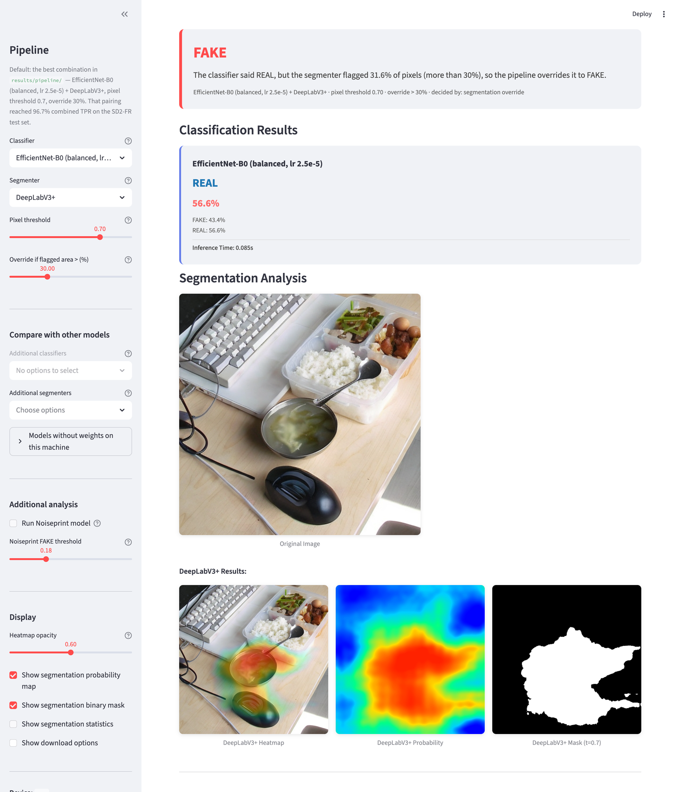
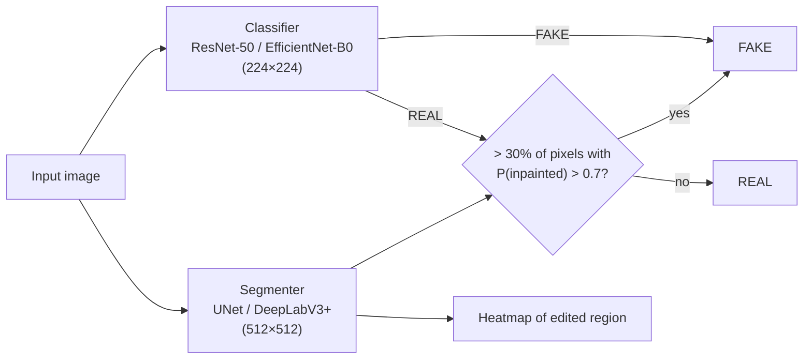

# AuthentiLens

**Detects AI-inpainted images and highlights the regions that were edited.** A classifier decides REAL vs FAKE, and a segmentation network localises the inpainted pixels and can overturn the classifier when it misses a partial edit.

**[Live demo](https://aperture-lens.streamlit.app)** &nbsp;·&nbsp; **[Model weights on Hugging Face](https://huggingface.co/iamgarvit/authentilens-weights)** &nbsp;·&nbsp; **[Report](docs/AuthentiLens_Project_Report.md)**



> Course project for **CSE344 Computer Vision, IIIT Delhi** (team Aperture).

**Highlights**

- Adding a segmentation override to the classifier raises fake-image recall from **71.4% to 96.7%** (EfficientNet-B0 + DeepLabV3+).
- A CIFAKE classifier that scored **100%** on a fake-only benchmark got **1.7%** on real images. We caught this with a balanced dataset of **14,362 patches**.
- Humans caught only **44–46%** of the fakes.

**Stack:** PyTorch, segmentation_models_pytorch, FastAPI, Docker, Streamlit, Hugging Face Hub.

## The problem

Diffusion models such as Stable Diffusion 2 and SDXL can **inpaint** part of a real photo: a text prompt replaces an object and the rest of the photo stays untouched. Most "AI image detectors" are trained on **fully synthetic** images (e.g. CIFAKE) and make one image-level call. In an inpainted image most pixels are genuine camera pixels, so:

- an image-level classifier sees mostly real content and often says REAL, and
- even when it says FAKE, it can't show **where** the edit is.

AuthentiLens pairs image-level classification with pixel-level localisation of the inpainted region.

## How it works



1. **Classifier** (ResNet-50 or EfficientNet-B0, fine-tuned from ImageNet) predicts FAKE/REAL on the resized image.
2. **Segmenter** (UNet or DeepLabV3+ with a ResNet-50 encoder) predicts a per-pixel probability that the pixel was inpainted.
3. **Override:** if the classifier says REAL but more than *X*% of pixels exceed probability 0.7, the pipeline outputs FAKE. We evaluated *X* = 30, 50 and 70; 30% works best.

The Streamlit demo (`app/`) and the FastAPI backend (`services/backend`) both run the best combination, **EfficientNet-B0 + DeepLabV3+**, at a pixel threshold of 0.7 and a 30% override; the demo also lets you swap models and tune both thresholds. The model code and the decision rule live in `authentilens/models.py`.

## Key finding: fake-only benchmarks hide classifier bias

Our first classifiers were trained on **CIFAKE**. The CIFAKE-trained ResNet-50 scored **100%** on the SD2-FR test set, but that set contains **only fake images**: a model that always answers FAKE also scores 100%.

To measure real-image accuracy we built a **balanced patch dataset** from SD2-FR (`scripts/process_sd2_dataset.py`):

- For every inpainted image, one **224×224 FAKE crop** centred on the inpainting mask, so it overlaps the edited region.
- One **224×224 REAL crop** from the same image with **zero** mask overlap: genuine camera content with the same scene and statistics.
- Classes balanced 1:1. Splits: **11,134 train / 1,596 val / 1,632 test** (see [docs/dataset.md](docs/dataset.md)).

On this balanced test set the CIFAKE ResNet-50 got **1.72% real-image accuracy**: it labels almost everything FAKE. Classifiers retrained on the balanced patches are far less biased (65–72% real accuracy), and the task is plainly hard: overall accuracy is about 60–63%.

## Results

All numbers come from the JSON files in [`results/`](results/) and [`human_evaluation/results/`](human_evaluation/results/).

### Classification ([results/classification](results/classification/comprehensive_evaluation_results.json))

"SD2-FR test" is 1,029 inpainted images (all fake). "Balanced test" is the 1,632-image patch test set (816 FAKE / 816 REAL).

| Model | Trained on | SD2-FR test (fake-only) acc. | Balanced test: overall | Balanced test: fake acc. | Balanced test: real acc. |
|---|---|---:|---:|---:|---:|
| ResNet-50 | CIFAKE | 100.00% | 50.43% | 99.14% | 1.72% |
| EfficientNet-B0 | CIFAKE | 68.22% | 50.00% | 67.40% | 32.60% |
| ResNet-50 | Balanced SD2 patches, lr 1e-4 | 61.22% | 61.95% | 57.97% | 65.93% |
| ResNet-50 | Balanced SD2 patches, lr 2.5e-5 | 58.99% | 63.11% | 61.03% | 65.20% |
| EfficientNet-B0 | Balanced SD2 patches, lr 1e-4 | 71.14% | 60.23% | 55.15% | 65.32% |
| EfficientNet-B0 | Balanced SD2 patches, lr 2.5e-5 | 71.43% | 61.27% | 50.86% | 71.69% |

### Segmentation ([results/segmentation](results/segmentation/segmentation_only_results.json))

SD2-FR test images with ground-truth masks, pixel threshold 0.7.

| Segmenter | mIoU | Pixel accuracy | Images |
|---|---:|---:|---:|
| DeepLabV3+ | 16.76% | 61.76% | 1,029 |
| UNet | 17.28% | 63.30% | 1,029 |

### Combined pipeline ([results/pipeline](results/pipeline/))

Fake-detection TPR on the 1,029 SD2-FR test images, with the classifiers trained on balanced patches (lr 2.5e-5) and a pixel threshold of 0.7. "Override > X%" flips REAL to FAKE when more than X% of pixels exceed that threshold (see [results/pipeline/README.md](results/pipeline/README.md)).

| Classifier + segmenter | Classifier alone | Pipeline, override > 30% | > 50% | > 70% |
|---|---:|---:|---:|---:|
| ResNet-50 + DeepLabV3+ | 58.99% | 94.85% | 67.15% | 59.18% |
| ResNet-50 + UNet | 58.99% | 86.59% | 67.54% | 59.67% |
| **EfficientNet-B0 + DeepLabV3+** | 71.43% | **96.70%** | 76.77% | 71.43% |
| EfficientNet-B0 + UNet | 71.43% | 91.74% | 77.45% | 72.40% |

> **Limitation:** SD2-FR test contains **only fake images**, so the pipeline's **false-positive rate is not yet measured**; a segmenter that flags many pixels on real photos would inflate these TPRs. The evaluation script can also run on real images (see [Training and evaluation](#training-and-evaluation)).

### Human evaluation ([human_evaluation/](human_evaluation/))

People labelled images through a web voting app. We took a per-image majority vote; ties count as wrong. "Voters" means unique browser sessions.

| Test set | Images | Voters | Majority-vote accuracy | REAL acc. | FAKE acc. | Ties |
|---|---:|---:|---:|---:|---:|---:|
| Balanced patches (`sd2-classification/test`) | 1,632 | 12 | 60.17% | 73.90% | 46.45% | 5 |
| SD2-FR test (all fake, 224×224) | 1,029 | 35 | 44.22% | n/a | 44.22% | 26 |

Humans find these edits hard too: on the fake-only set they are below chance.

## Quickstart

### Install

```bash
git clone https://github.com/iamgarvit/AuthentiLens.git && cd AuthentiLens
python -m venv .venv && source .venv/bin/activate
pip install -r requirements.txt
```

### Get the weights

```bash
hf download iamgarvit/authentilens-weights --local-dir checkpoints \
    --include "classification/*" --include "segmentation/*"
```

These checkpoints, plus the ResNet-50 and other EfficientNet-B0 runs, are also in this repository via Git LFS (not fetched by clones). How to fetch them, with provenance and checksums, is in [checkpoints/segmentation/deeplabv3plus/README.md](checkpoints/segmentation/deeplabv3plus/README.md) and [checkpoints/segmentation/unet/README.md](checkpoints/segmentation/unet/README.md).

### Run the demo

```bash
streamlit run app/streamlit_app.py      # standalone demo on http://localhost:8501
docker compose up --build               # API + client: UI on :8501, API docs on http://localhost:8000/docs
```

The demo defaults to the evaluated pipeline. Models whose weights are missing are hidden, and the API falls back to classification-only mode and says so on screen.

**Deployment:** the hosted demo, the Hugging Face routes and running the API without Docker are covered in [docs/DEPLOYMENT.md](docs/DEPLOYMENT.md).

## Training and evaluation

Put the datasets under `data/` as described in [data/README.md](data/README.md). Commands run from the repo root (scripts also work from any directory):

```bash
python scripts/process_sd2_dataset.py               # build the balanced 224×224 patch dataset

python training/train_resnet_balanced.py            # classifiers -> checkpoints/classification/<model>/
python training/train_efficientnet_balanced.py      # or: bash training/run_training_balanced.sh
python training/train_resnet_cifake.py              # CIFAKE baselines
python training/train_efficientnet_cifake.py
jupyter notebook training/notebooks/train_deeplabv3plus.ipynb   # segmenters -> checkpoints/segmentation/<model>/
jupyter notebook training/notebooks/train_unet.ipynb

python evaluation/evaluate_classifiers.py           # evaluations -> results/
python evaluation/evaluate_segmentation.py
python evaluation/evaluate_pipeline.py                                              # fake-only TPR
python evaluation/evaluate_pipeline.py --real-dir data/sd2-classification/test/REAL  # + real accuracy / FPR / precision / F1
python evaluation/evaluate_imd2020.py --dataset data/IMD2020                        # needs the API running
python human_evaluation/calculate_accuracy.py
```

`--real-dir` accepts any folder of real photos. The `sd2-classification/test/REAL` crops are 224×224, so they are upsampled to 512 for segmentation; full-size photos such as the MS-COCO originals behind SD2-FR also work.

## Repository structure

```
app/                Streamlit demo (all models, tunable thresholds)
services/backend/   FastAPI inference API (EfficientNet-B0 + DeepLabV3+ pipeline)
services/frontend/  Streamlit client for the API
authentilens/       Shared code: paths.py, models.py (pipeline)
training/           Classifier training scripts, segmentation notebooks
evaluation/         Classifier / segmentation / pipeline / IMD2020 evaluation
scripts/            Dataset preparation and utilities
human_evaluation/   Voting app, registries and collected votes
checkpoints/        Model weights (Git LFS, not fetched by clones)
results/            Evaluation outputs used in this README
hf_space/           Hosted demo entry point (see docs/DEPLOYMENT.md)
data/               Datasets (not in git), see data/README.md
docs/               Report, presentation, dataset card, deployment notes
```

## Team and contributions

- **Divyanshu Yadav:** segmentation datasets, segmentation models, pipeline ablations, web interface
- **Garvit:** classification datasets, classification models, custom balanced dataset, pipeline ablations, web interface
- **Rewant Anand** and **Tanish Bachhas:** literature review, SOTA models, NoisePrint analysis, frontend template

CSE344 Computer Vision, IIIT Delhi. The full write-up is in [docs/AuthentiLens_Project_Report.md](docs/AuthentiLens_Project_Report.md).

## References

- **DIRE:** Z. Wang et al., "DIRE for Diffusion-Generated Image Detection", ICCV 2023. [arXiv:2303.09295](https://arxiv.org/abs/2303.09295)
- **FIRE:** B. Chu et al., "FIRE: Robust Detection of Diffusion-Generated Images via Frequency-Guided Reconstruction Error", CVPR 2025. [arXiv:2412.07140](https://arxiv.org/abs/2412.07140)
- **Art or Artifact?:** "Art or Artifact? Segmenting AI-Generated Images for Deeper Detection", 4th Workshop on Security Implications of Deepfakes and Cheapfakes, 2025. [doi:10.1145/3709022.3736544](https://dl.acm.org/doi/10.1145/3709022.3736544)
- **CIFAKE:** J. J. Bird and A. Lotfi, "CIFAKE: Image Classification and Explainable Identification of AI-Generated Synthetic Images", IEEE Access, 2024. [arXiv:2303.14126](https://arxiv.org/abs/2303.14126)
- **TGIF / SD2-FR:** H. Mareen et al., "TGIF: Text-Guided Inpainting Forgery Dataset", WIFS 2024. [arXiv:2407.11566](https://arxiv.org/abs/2407.11566), [dataset](https://github.com/IDLabMedia/tgif-dataset)
- **ResNet:** K. He et al., "Deep Residual Learning for Image Recognition", CVPR 2016. [arXiv:1512.03385](https://arxiv.org/abs/1512.03385)
- **EfficientNet:** M. Tan and Q. V. Le, "EfficientNet: Rethinking Model Scaling for Convolutional Neural Networks", ICML 2019. [arXiv:1905.11946](https://arxiv.org/abs/1905.11946)
- **U-Net:** O. Ronneberger et al., "U-Net: Convolutional Networks for Biomedical Image Segmentation", MICCAI 2015. [arXiv:1505.04597](https://arxiv.org/abs/1505.04597)
- **DeepLabV3+:** L.-C. Chen et al., "Encoder-Decoder with Atrous Separable Convolution for Semantic Image Segmentation", ECCV 2018. [arXiv:1802.02611](https://arxiv.org/abs/1802.02611)
